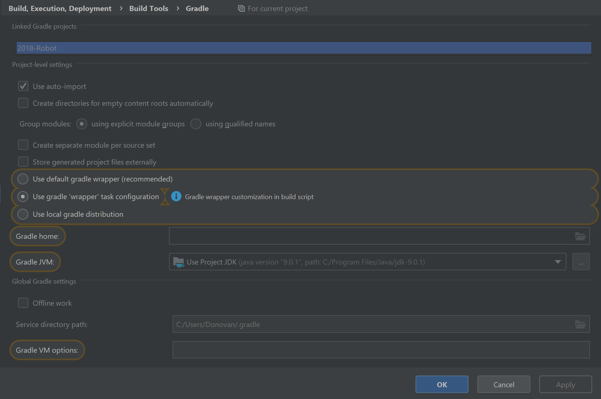

# Setting up the GradleIO project

### 1. Cloning the Repository
* Clone this project to a desired directory by typing in:
 ```git clone https://github.com/athenian-robotics/Skeleton2.0.git```
* Open the project with IntelliJ, when opening the project, a window should pop up to ask you to import gradle setup, set it up as the picture below, note that the important part is to ``Use gradle 'wrapper' task config``


### 2. Installing Quickstart.zip
* Go to [https://github.com/wpilibsuite/GradleRIO/blob/master/Quickstart.zip](https://github.com/wpilibsuite/GradleRIO/blob/master/Quickstart.zip) and install **Quickstart.zip**.
* Unzip the file and put it in a folder

!!! warning "Extracting Files"
    Do the following very carefully, if you don't the project will go wrong. 

* There will be 2 folders in Quickstart.zip, ``java`` and ``cpp``, go in side the ``java`` folder and copy ``gradle``, ``gradlew``, and ``gradlew.bat``, paste those files
inside the root of your working directory. 
* **Don't copy over anything else, such as `src/` or `build.gradle`.**

 

* To build the Gradle Project, you need to open your terminal, it should be located on the bottom of IntelliJ (you can also use independent terminal if you know how to)


!!! note "Window and Mac Setup Differs"
    * For **Windows**, simply type ``gradlew build`` in the terminal and you are done
    * For **Mac**, type ``chmod u+x gradlew`` into terminal to grant it the permissions to execute, then type in ``./gradlew idea``, then you are done.

* Last of all, if the ``java`` folder (under ``src/main``) is not marked as source, right click on it and mark it as source.