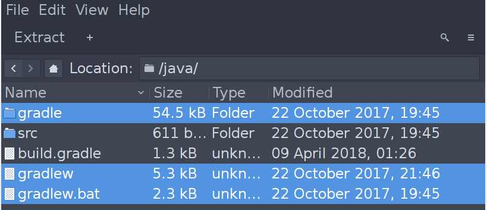
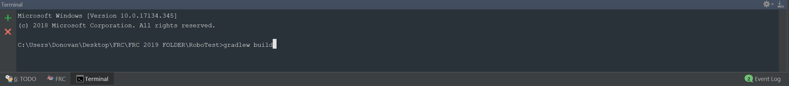
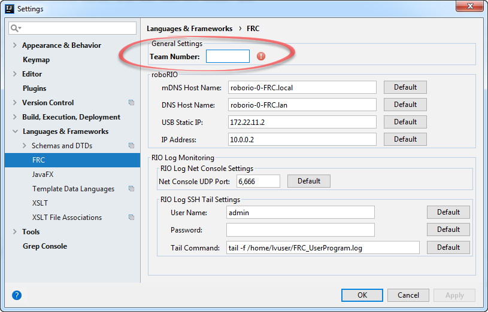
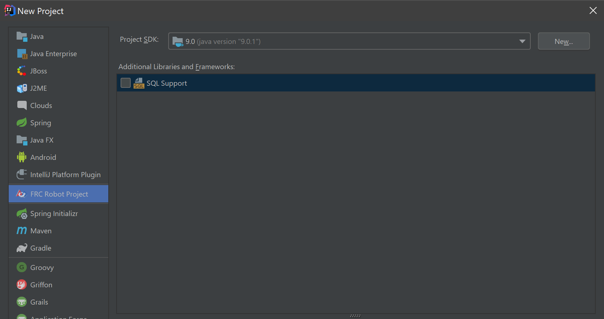
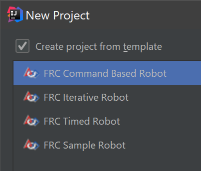

# Setting up the GradleIO project

## Creating and Building from an existing Project Method 1
* Clone the project and put it in a desired directory


## Creating and Building from an existing Project Method 2
* Clone the project and put it in a desired directory
* When opening the project, a window should pop up to ask you to import gradle setup, set it up as the picture below, note that the important part is to ``Use gradle 'wrapper' task config``


* If everything goes correctly and you imported all the right stuff, that should be all you need to do 

### 1. Installing Quickstart.zip
* Go to [https://github.com/wpilibsuite/GradleRIO/blob/master/Quickstart.zip](https://github.com/wpilibsuite/GradleRIO/blob/master/Quickstart.zip) and install **Quickstart.zip**.
* Unzip the file and put it in a folder.

!!! warning "Extracting Files"
    Do the following very carefully, if you don't the project will go wrong. 

* There will be 2 folders in Quickstart.zip, ``java`` and ``cpp``, go in side the java folder and copy ``gradle``, ``build.gradle``, ``gradlew``, and ``gradlew.bat``, paste those files
inside the root of your working directory.

 

* After pasting them in your working directory go to edit ``build.gradle``, you will see those lines of code: 
``` 
def TEAM = 852
def ROBOT_CLASS = "frc.team852.robot.Robot"
```
replace the ``TEAM`` number and the ```team0000``` number with **852** like I've done above.

* To build the Gradle Project, you need to open your terminal, it should be located on the bottom of IntelliJ (you can also use independent terminal if you know how to)



!!! note "Window and Mac Setup Differs"
    * For **Windows**, simply type ``gradlew build`` in the terminal and you are done
    * For **Mac**, type ``chmod u+x gradlew`` into terminal to grant it the permissions to execute, then type in ``./gradlew``, then you are done.

* Congrats, you are done, if ``src`` folder is not marked as source, mark it as source.


## Creating a new FRC Project

### 1. Downloading the FRC Plugin from IntelliJ:

* UPDATE INTELLIJ TO THE LATEST VERSION, it might not work otherwise

!!! warning "You can skip the following if it's not you have already downloaded the plugin"
    * Open IntelliJ and go to ``File -> Setting -> Plugins``   
    * Under the **Plugins** panel, click the ``Browse Repository`` 
    button and search up ``FRC`` in the search bar, and download the only option that shows up
    * Restart IntelliJ
    * Go to ``File -> Settings -> Language & Frameworks -> Schemas and DTDs -> FRC`` and set the team name to **852**
    
    
    
* Create the new FRC Project, ``File -> New -> Project``

* When the windows pop up, choose ``FRC Project`` and ``FRC Command Based Robot``


* And you're done! 